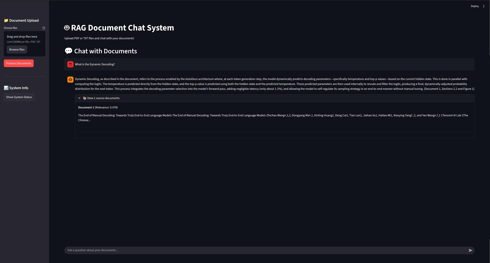

# EduRAG: Educational Retrieval-Augmented Generation System

## Overview
EduRAG is an AI-powered educational platform designed to enhance learning experiences by leveraging Retrieval-Augmented Generation (RAG). This system combines document retrieval, embeddings, and language models to provide context-aware and interactive responses to user queries. The project is structured to be modular, making it easy to extend and adapt for various educational purposes.

---

## Project Structure

### 1. **Situation**
The project is designed to address the challenge of efficiently retrieving and utilizing information from large document collections. It provides a framework for:
- Uploading and processing documents (PDF/TXT).
- Generating embeddings for semantic search.
- Retrieving relevant documents based on user queries.
- Generating context-aware responses using language models.

### 2. **Task**
The goal is to create a system that:
- Allows users to upload documents.
- Processes and stores these documents in a vector database.
- Retrieves relevant information based on user queries.
- Generates accurate and concise responses using the retrieved information.

### 3. **Action**
The project is divided into the following components:

#### **Main Application**
- **`main.py`**: Entry point for the Streamlit-based user interface. It provides:
  - Document upload functionality.
  - Chat interface for querying the knowledge base.
  - System status and debugging information.

#### **Workflows**
- **`workflows/upsert_workflow.py`**: Handles the document ingestion pipeline.
  - Loads documents using `DocumentLoader`.
  - Encodes documents into embeddings using `EmbeddingsManager`.
  - Updates the vector store with the processed data.
- **`workflows/retrive_workflow.py`**: Implements the retrieval and response generation pipeline.
  - Retrieves relevant documents from the vector store.
  - Generates prompts and responses using OpenAI's language model.

#### **Source Code**
- **`src/document_loader.py`**: Loads and processes documents from the file system.
  - Supports both TXT and PDF formats.
  - Extracts text from PDF files using `PyPDF2`.
- **`src/embeddings_manager.py`**: Manages embeddings for semantic search.
  - Uses `SentenceTransformers` to encode text into embeddings.
  - Provides utilities for calculating similarities.
- **`src/vector_store.py`**: Interfaces with ChromaDB for vector storage and retrieval.
  - Handles chunking of large documents.
  - Manages collection creation, updates, and queries.

#### **Utilities**
- **`utils/config_file.py`**: Centralized configuration for the system.
  - Defines default models, vector store settings, and retrieval parameters.

#### **Data**
- **`data/documents/`**: Directory for storing uploaded documents.

#### **Templates**
- **`template.py`**: Script for creating the project structure.

### 4. **Result**
The system provides:
- A user-friendly interface for uploading and querying documents.
- Accurate and context-aware responses based on the uploaded knowledge base.
- Modular and extensible code for further development.

---

## Installation

### Prerequisites
- Python 3.12 or higher
- API keys for OpenAI and ChromaDB (set in `.env` file)

### Steps
1. Clone the repository:
   ```bash
   git clone https://github.com/aakashsyadav1999/EduRAG.git
   cd EduRAG
   ```
2. Install dependencies:
   ```bash
   pip install -r requirements.txt
   ```
3. Set up environment variables in `.env`:
   ```env
   CHROMADB_API_KEY=your_chromadb_api_key
   OPENAI_API_KEY=your_openai_api_key
   ```
4. Run the application:
   ```bash
   streamlit run main.py
   ```

---

## Usage

1. **Upload Documents**
   - Navigate to the "Document Upload" section in the sidebar.
   - Upload PDF or TXT files to add them to the knowledge base.

2. **Chat with Documents**
   - Use the chat interface to ask questions about the uploaded documents.
   - View retrieved documents and their relevance scores.

3. **System Info**
   - Check the system status and configuration in the sidebar.

---

## Key Features

- **Document Ingestion**: Supports TXT and PDF formats.
- **Semantic Search**: Uses embeddings for accurate retrieval.
- **Context-Aware Responses**: Generates responses based on retrieved documents.
- **Extensibility**: Modular design for easy integration of new features.

---

## Screenshots

### Chat Interface


---

## Contributing

Contributions are welcome! Please fork the repository and submit a pull request with your changes.

---

## License

This project is licensed under the MIT License. See the `LICENSE` file for details.

---

## Acknowledgments

- [OpenAI](https://openai.com/) for the language model API.
- [ChromaDB](https://www.trychroma.com/) for the vector database.
- [SentenceTransformers](https://www.sbert.net/) for embeddings.